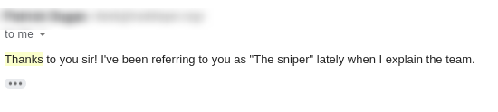
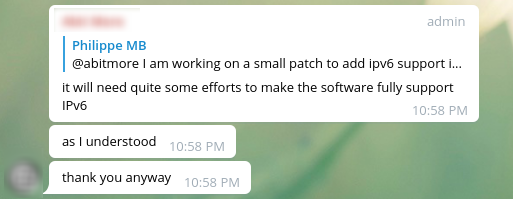
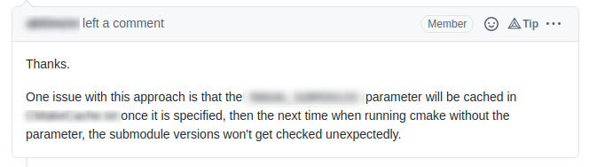
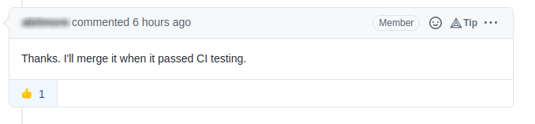

## Hi there, I'm Philippe - aka [sinetek](https://github.com/sinetek) 👋

# I'm a Developer! 🚀

✅ I have my own firm, we're doing work in the bitcoin/altcoin space since [at least 2014](https://github.com/bitcoin/bitcoin/pull/5245).
 
✅ I am looking for work now in the altcoin space. If you have a project -> [please contact me: sinetek@gmail.com](mailto:sinetek@gmail.com).
 
✅ I have a [website](https://sinetek.io).
 

## Myself in a nutshell:

## Conversation with me:

👊🏻 For business enquiries, ➡️ [please use email: sinetek@gmail.com](mailto:sinetek@gmail.com)
 

# ⚡️ What they said...👇

